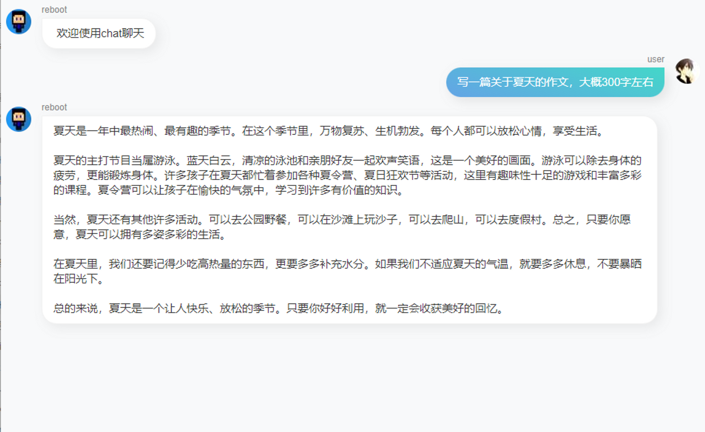
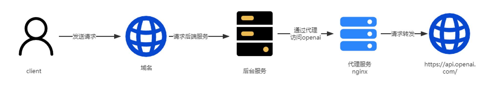
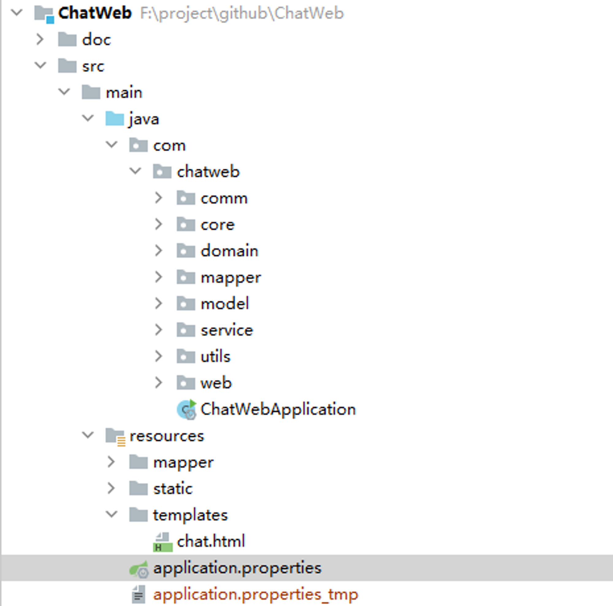
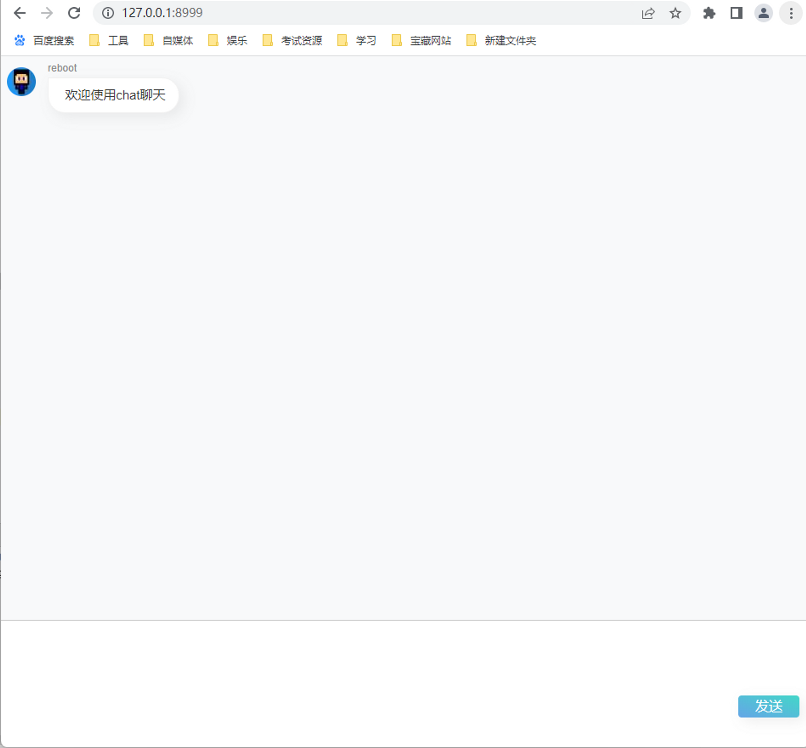
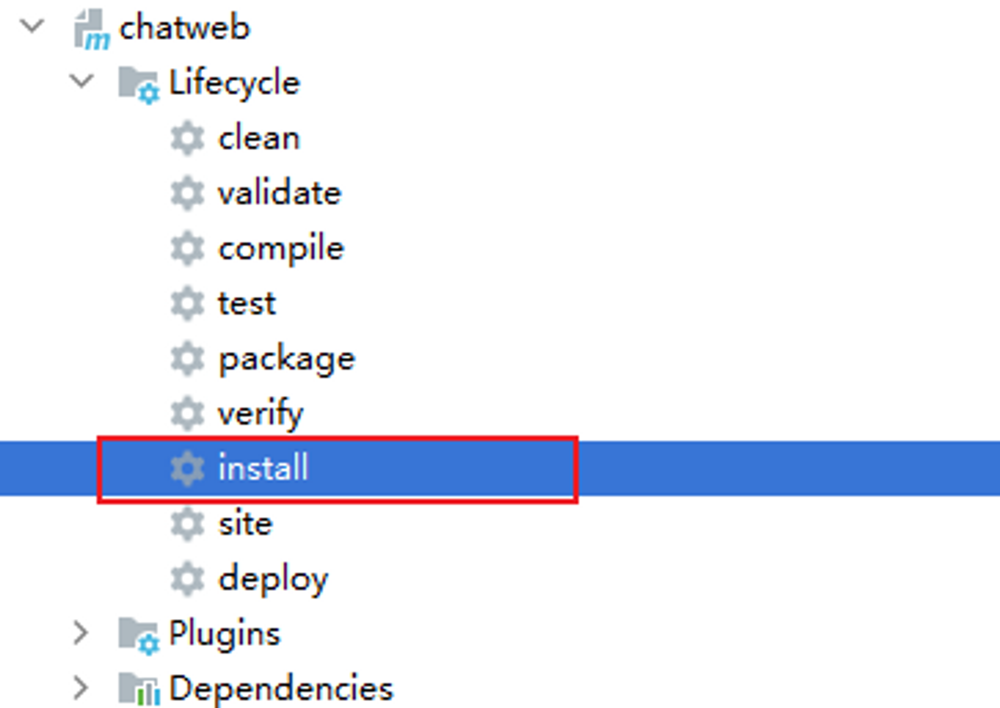

# 1.前言

前几天发表了一片保姆级JAVA对接ChatGPT教程，实现自己的AI对话助手的文章，发现对于一些未对接过的朋友们还是有些门槛。这两天把又代码整理了下，简单写了个web端聊天式对话机器人。供大家参考学习。


# 2.项目介绍

## 2.1.技术简介

### 2.1.1.技术框架

项目主要使用SpringBoot开发，tomcat当做项目容器，Mybiats为数据库持久层框架，Maven构建，H5作为去前端技术开发。比较适合新手学习。

### 2.1.2 网络拓扑


因为访问openai是不通的，所以我们中间需要搭建一个代理服务（有魔法科技的当我没说），通过代理服务访问openapi，代理服务部署在香港即可。

## 2.2.目录结构

项目目录结构如下

- doc：存放数据库脚本以及文档
- src/main/java：后端工程
- resource/static 和 template：前端工程文件
  

## 2.3.项目启动

1. 新建mysql数据库chatweb，将项目中doc目录下的sql脚本导入数据库中
2. 将项目导入IDEA中，并修改配置文件application.properties中的如下配置

- **spring.datasource.url**：数据库地址
- **spring.datasource.username** ：数据库账号
- **spring.datasource.password** ：数据库密码
- **open.ai.token**：openai接口调用key
- **open.ai.url**：openAi访问地址，直接访问不通，需要搭建香港nginx代理进行访问

```jsx
#spring.profiles.active = dev
server.port = 8999
spring.application.name = OpenAi
#
#
#
#
#
#  db
config
start
#
#
#
#
#
#
    spring.datasource.url = jdbc
:
mysql://XXXX:3306/chatweb?serverTimezone=UTC&useUnicode=true&characterEncoding=utf-8
    spring.datasource.username = XXXX
spring.datasource.password = XXX
spring.datasource.driver - class - name = com.mysql.cj.jdbc.Driver
#mybatis
mybatis.mapper - locations = classpath
:
mapper/*.xml
mybatis.type-aliases-package=com.wentap.mapper
mybatis.configuration.map-underscore-to-camel-case=true
mybatis.configuration.call-setters-on-nulls=true
######   logging config start ######
logging.file=./log/service.log
logging.level.com.chatweb=INFO
logging.level.org.springframework.web=INFO
#####   mail setting end #####
spring.thymeleaf.cache=false
## openAi访问地址，直接访问不通，需要搭建nginx代理进行访问
open.ai.url=https://api.openai.com/
## API-Key
open.ai.token=XXX
## 连续会话支持长度
session.num=10
## 连续会话有效时间（单位:小时）
session.time=4
## token长度，结果返回的长度
token.num=500
spring.thymeleaf.mode=LEGACYHTML5
```

1. 编译项目，之后运行**`ChatWebApplication`**
2. 执行成功之后访问[http://127.0.0.1:8999](http://127.0.0.1:8999/)即可打开页面
   

## 2.4.项目部署

如果大家想把项目部署云服务器上，则只需要如下操作

1. 在IDEA中，执行maven install 命令，待编译完成之后在targer目录下生成jar包。
   
1. 在IDEA中，执行maven install 命令，待编译完成之后在targer目录下生成chatweb-1.0.jar包
2. 将服务中的start.sh、stop.sh脚本和chatweb-1.0.jar包一起丢到云服务器上
3. 执行start.sh脚本即可
4. 如果是windows下，则直接在jar包所在目录执行java -jar chatweb-1.0.jar 即可。

# 3.git项目地址